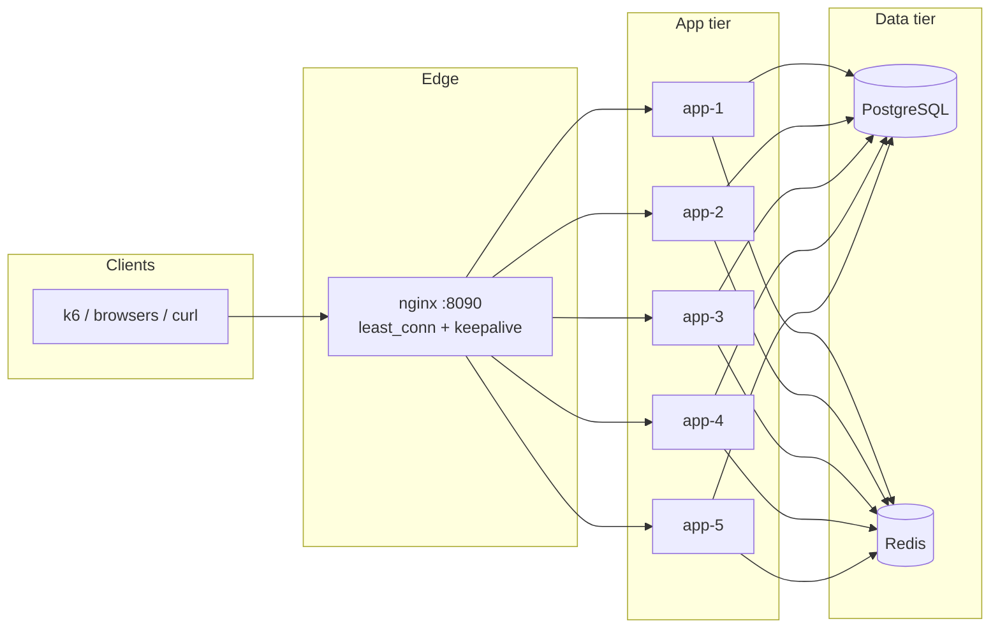

# Distributed Rate Limiter

Reference implementation of a **horizontally scaled Spring Boot API** with **Redis-backed distributed rate limiting**, **JWT authentication**, **PostgreSQL** persistence, and **Redis-backed caching** for user profiles. Multiple app replicas sit behind **nginx** so you can observe load balancing, per-instance headers, and shared limiter state in one stack.

---

## What this project is

| Piece | Role |
|--------|------|
| **Spring Boot 4** (Java 17) | REST API: `/auth/*`, `/api/users/*`, OpenAPI/Swagger, Actuator health |
| **nginx** | Single entrypoint (`:8090`), `least_conn` upstream to **5** identical app containers |
| **Redis** | Atomic rate limits via **Lua**; optional **AOF** in Compose; **shared cache** for users |
| **PostgreSQL** | Users, roles, credentials (bcrypt) |
| **k6** | Load scripts for sustained traffic, login bursts, cache-oriented profiles |

Rate limiting is implemented as a **servlet `Filter`** that runs very early (after a thin diagnostics filter). It enforces limits **per client IP** and, when a `Bearer` JWT is present, **per authenticated user id**—using the **same Redis keys** from every replica, so limits are global across the cluster.

Documented **k6** runs on this stack have pushed **roughly 100k–150k requests** per scenario (peak **~150k** in a full sustained run), **500–1,000** setup users (script-tunable), and **up to ~1,500 concurrent VUs** without crashing the processes; timings and saturation figures are called out again in **Load testing (k6)**, **Architecture**, and **Tradeoffs** where they inform behavior.

---

## Why it exists

- **Demonstrate “distributed” limits**: Without a shared store, each replica would track its own counters and the effective limit would scale with replica count. **Redis + a single atomic script** keeps one logical budget for each IP/user.
- **Show realistic API concerns**: Auth, caching, connection pools, Tomcat tuning comments, and **instance identity** (`X-Instance-Id`, JSON body `instanceId` on 429) for debugging under load.
- **Provide a reproducible environment**: `docker-compose` brings up DB, Redis, five apps, and nginx; **k6** scripts document how rate limits interact with setup (e.g. sequential register from one IP).

---

## How rate limiting works

### Request path

1. Client hits **nginx** → forwarded to one of `app-1` … `app-5` with `X-Forwarded-For` set.
2. **`RateLimitFilter`** (registered in `RateLimitFilterConfig`) resolves the client IP from `X-Forwarded-For` (first hop) or `request.getRemoteAddr()`.
3. **IP scope**: `RedisDistributedRateLimiter.tryConsumeForIp` runs a **Lua script** on Redis with keys `rl:tb:ip:*` and `rl:sw:ip:*` (prefix configurable via `app.rate-limit.key-prefix`).
4. **Optional user scope**: If `Authorization: Bearer …` is present, the filter **parses the JWT** (via `JwtService`) to obtain `userId`, then runs the same script for `rl:tb:user:*` / `rl:sw:user:*`.
5. If either dimension rejects the request, the filter responds with **HTTP 429** and a small JSON payload including `scope` (`ip` or `user`) and **`instanceId`** so you can tell which replica answered.

**Under deliberate overload** (for example sustained scripts with **~1,000–1,500 VUs** and **shared-IP** traffic), responses skew heavily to **429**: on the order of **99%+** of requests once the limiter and thread pools are saturated, with **~99.5%–100%** of outcomes matching “blocked by policy” vs “unexpected server fault.” In an extreme all-throttled example, **150,000 / 150,000** iterations can present as **429**. Spurious **500** responses stayed **near zero** in typical runs (**~0–17** at worst in sampled stress passes—treat as environmental noise, not a correctness target).

Health, Swagger UI, and OpenAPI docs are **excluded** from the rate limit filter (`/actuator/health`, `/swagger-ui*`, `/v3/api-docs*`). `OPTIONS` is passed through.

### Algorithm: token bucket + sliding window (atomic)

The Lua script in `ratelimiter/src/main/resources/lua/rate_limit_pair.lua`:

1. **Token bucket** (hash per dimension): refills tokens continuously based on elapsed time; consumes **cost** (1) if enough tokens exist.
2. **Sliding window** (sorted set): removes entries older than the window, checks cardinality against `sw_max`; if the window is full, the script **refunds** the token bucket and returns **deny**.

Using **one `EVALSHA`/`execute` round trip** keeps the bucket and window **consistent** for that dimension—no interleaved read/modify races from multiple app instances.

### Caching

User profile reads use Spring `@Cacheable` with a **`RedisCacheManager`** (`RedisCacheConfig`): entries live under Redis keys prefixed `cache:*`, with TTLs from `application.yml` (`app.cache.*`).

---

## Architecture



**Filter / security ordering (simplified)**:

- `RequestInboundTimingFilter` (optional diagnostics) → **`RateLimitFilter`** → Spring Security (`JwtAuthenticationFilter`, etc.) → controllers.

**Notable observability hooks** (disabled by default; see `app.diagnostics` in `application.yml`):

- Log servlet filter registration at startup.
- Warn when work inside `RateLimitFilter` or downstream security exceeds a threshold.

**Layout as exercised under load:** **five** Spring Boot replicas behind **one** nginx reverse proxy; **one** shared **Redis** instance holds rate-limit state (**atomic Lua** per consume) and the optional user-profile cache. PostgreSQL is configured in Compose with **`max_connections=200`** so the cluster can open many client sessions at once; each app instance uses **Hikari** with **`DB_POOL_MAX` ≈ 32** connections by default (**≈160** connections across five replicas—leave headroom below the server cap). The **k6** host was run with a **file descriptor limit** around **`ulimit -n` 10,000** for large fan-out tests.

---

## Configuration highlights

Defined in `ratelimiter/src/main/resources/application.yml` (overridable with environment variables):

| Area | Purpose |
|------|---------|
| `app.rate-limit.token-bucket.*` | Burst-friendly **capacity** and **refill per second** for IP and user |
| `app.rate-limit.sliding-window.*` | **Window length** and **max requests** for IP and user |
| `app.instance.id` | Replica id (`APP_INSTANCE_ID` in Compose) → `X-Instance-Id` header |
| `app.jwt.*` | HS256 secret and token lifetime |
| Tomcat `threads`, `accept-count`, `max-connections` | Tunables for overload behavior under k6 |

Compose wires **five** app services with distinct `APP_INSTANCE_ID`, one Redis, one Postgres, and nginx publishing **host port 8090**.

---

## Tradeoffs

| Choice | Benefit | Cost / risk |
|--------|---------|-------------|
| **Redis + Lua** | Strong atomicity per key pair; simple horizontal scale-out | Redis becomes a **critical dependency**; hot keys can become bottlenecks |
| **Token bucket + sliding window together** | Smooth bursts **and** hard caps per rolling interval | More Redis work per allowed request than a single algorithm |
| **JWT parsed in `RateLimitFilter`** | User scoped limits without hitting the DB on every request | **Duplicate JWT work** with Spring Security’s filter; must stay consistent with signing/validation assumptions |
| **`X-Forwarded-For` first hop as IP** | Correct client IP behind nginx | If the edge proxy is **not** trusted, clients could spoof IPs—**terminate TLS and sanitize headers** at a trusted boundary |
| **`ddl-auto: update`** (default in yml) | Fast local/demo iteration | **Not** a production migration strategy—use explicit schema management |
| **JDK serialization for cache values** | Quick integration with Spring Data Redis cache | Less portable/evolvable than explicit DTO serialization; ensure classpath compatibility when upgrading |

**Stress characterization (where time goes):** With the default stack, **Redis** script latency stayed in the **sub-millisecond to low-millisecond** range in observed runs—it was **not** the dominant bottleneck once traffic was high. Instead, **waiting in the servlet container** and **CPU-heavy auth paths** (for example **bcrypt** on `/auth/login`) showed **thread-pool saturation** and **queueing**: peak **waiting** on the order of **~9–12 seconds** under the heaviest login-weighted mixes, and end-to-end latency long tails (**p90 ~3.2–7.7 s**, **p95 ~3.3–7.8 s**, **max ~14 s**) while the median remained **~0.29–0.69 s** and averages **~0.7–1.7 s** depending on scenario stage. Throughput then tracks scenario mix: **~800–1,100 req/s** at the highest sustained-window samples versus **~97–277 req/s** (and **~97–275 iterations/s**) when stages are more IP-throttled or login-bound.

---

## Failure scenarios and behavior

| Scenario | What typically happens |
|----------|-------------------------|
| **Redis unavailable** | Rate limit `execute` fails; requests are likely to **error (5xx)** unless you add resilience (circuit breaker, fail-open, or queued retry). This stack prioritizes **correct enforcement** over silent bypass. |
| **PostgreSQL unavailable** | Registration/login and DB-backed paths fail; **Actuator** may still expose liveness depending on health contributors—validate before relying on it in K8s. |
| **Single app replica down** | nginx `max_fails` / `fail_timeout` marks upstream unhealthy; traffic shifts to peers. **Rate limits remain correct** as long as Redis is up. |
| **Clock skew between app hosts** | Token bucket uses **`System.currentTimeMillis()`** from the app JVM passed into Lua; large skew between replicas can slightly distort refill behavior (usually minor vs window sizes). |
| **Very aggressive limits + k6 setup from one IP** | Bulk `/auth/register` from a single machine can hit **IP** limits; scripts pace/register with retries—see `k6/sustained_load.js` comments. |

In the documented stress passes, the **Docker Compose** stack stayed **up** (**no crashes**, **no interrupted** k6 iterations attributed to backend death); failures were dominated by **429** as intended rather than mass **5xx** (see **How rate limiting works**).

For production you would add **timeouts**, **bulkheads**, **idempotency**, **rate-limit response headers** (e.g. `Retry-After`), and explicit **SLOs** for Redis/DB.

---

## Setup guide

### Prerequisites

- **Docker** + **Docker Compose** (v2 plugin)
- Optional: **Java 17**, **Maven**, **k6** for local runs without Docker

### Run the full stack (recommended)

From the repository root:

```bash
docker compose up --build
```

- API (via nginx): **http://127.0.0.1:8090**
- Postgres on host: **localhost:5433** (user/db/password: `ratelimiter` per `docker-compose.yml`)
- Swagger UI: **http://127.0.0.1:8090/swagger-ui.html**

Health check:

```bash
curl -sS http://127.0.0.1:8090/actuator/health
```

**Security:** Change `JWT_SECRET` and database passwords before any real deployment. The sample secret in Compose is for **local demonstration only**.

### Run the Spring app locally (without Compose)

1. Start **PostgreSQL** and **Redis** matching `application.yml` defaults (or export `SPRING_DATASOURCE_*` / `SPRING_DATA_REDIS_*`).
2. From `ratelimiter/`:

```bash
./mvnw -q test
./mvnw spring-boot:run
```

The app listens on **8080** by default (Compose overrides to 8080 inside the container; host access is via nginx on 8090).

### Load testing (k6)

Examples (after Compose is up):

```bash
k6 run -e BASE_URL=http://127.0.0.1:8090 k6/sustained_load.js
```

Other scripts in `k6/`: `login_burst.js`, `profile_cache.js`.

**Scale (what “medium” vs “full” looked like in documented runs):** total requests landed around **100k–150k per run**, with the heaviest sustained profile topping out near **~150k** iterations. **Concurrent VUs** were pushed to **~1,000** for medium-style runs and **~1,500** for stress. Setup seeds **500–1,000** users via `SUSTAINED_USER_COUNT` (and similar knobs in other scripts). Wall-clock was about **~3 minutes** for shorter medium passes versus **~9–15 minutes** end-to-end for full sustained runs **including** registration/setup; `sustained_load.js` defaults **`setupTimeout`** to **25m** (`SUSTAINED_SETUP_TIMEOUT`) so sequential `/auth/register` from **one client IP** can finish under IP rate limits without k6 aborting setup early.

**Scenario shape:** scripts intentionally include **shared-IP** traffic as a **worst-case** for the IP dimension; executor ramp or steady phases varied roughly **~30 s–2 minutes** depending on the script and options.

**Throughput (same runs, for orientation only):** peak sustained windows produced on the order of **~800–1,100 req/s**; throttled or login-heavy segments read closer to **~97–277 req/s**, with iteration rates in a similar **~97–275 /s** band.

**Latency (under heavy saturation):** treat these as **environment-specific**—they reflect nginx + five JVMs + local Docker I/O—not a universal SLA. Representative aggregates were **average ~0.7–1.7 s**, **median ~0.29–0.69 s**, long tails **p90 ~3.2–7.7 s** and **p95 ~3.3–7.8 s**, and **max ~14 s** spikes when pools were deeply contended.

Tune `SUSTAINED_USER_COUNT`, `SUSTAINED_VUS`, `SUSTAINED_ITERATIONS`, `SUSTAINED_SETUP_TIMEOUT`, and `BASE_URL` via `-e` flags to reproduce or relax the above envelopes.

---

## Project layout

```
distributed-rate-limiter/
├── docker-compose.yml      # Postgres, Redis, app x5, nginx
├── nginx/nginx.conf        # Upstream + X-Forwarded-For
├── k6/                     # Load tests
└── ratelimiter/            # Spring Boot service (Maven)
    ├── Dockerfile
    ├── src/main/java/...
    └── src/main/resources/
        ├── application.yml
        └── lua/rate_limit_pair.lua
```

---

## License

Add a `LICENSE` file if you intend open-source distribution; none is bundled in this template.
